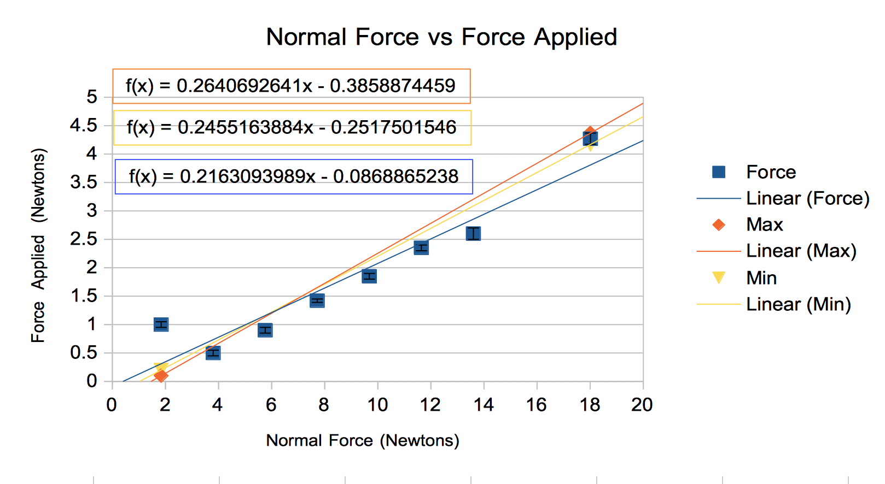

```{r echo=FALSE}
knitr::opts_chunk$set(echo = F, out.height = "10cm", fig.align = "center", fig.pos = "H")
```

# Calculating Error Bars \label{sec:err}

The instrumental error was calculated based on the instrument. For analog instruments, it is equal to half of the smallest graduation. The procedural error was calculated using the formula in Equation \eqref{eqn:error}.

\begin{equation}
  E_{\text{procedural}} = \frac{\text{max} - \text{min}}{2} \label{eqn:error}
\end{equation}

As an example, I will calculate the procedural error for the first trial, which was for a mass of 187.60 grams. The results are in Table \ref{tab:trials}.

```{r trials}
library(kableExtra)
read.csv("./data/mass-1.csv") %>%
  kbl(booktabs = T, col.names = c("Trial","Force"), caption = "Data for a mass of 187.60 grams", position = "H") %>%
    kable_styling(latex_options = "striped")
```

\begin{eqnarray}
  E_{\text{procedural}} & = & \frac{\text{max} - \text{min}}{2} \\
                        & = & \frac{0.15-0.05}{2} \\
                        & = & 0.05 
\end{eqnarray}

When calculating the error bars, the largest of the two errors was used. A complete rundown of all error calculations is on Table \ref{tab:error-bars}.

```{r error-bars}
library(kableExtra)
data <- read.csv("./data/error-bars.csv")
kbl(data, col.names = c("Instrumental Error", "Procedural Error", "Largest"), booktabs = T, caption = "Error Bar Values") %>%
  kable_styling(latex_options = "striped")
```

# Applied Force Values \label{sec:applied-force}

The applied force values for each trial were averaged out. The average values can be found in Table \ref{tab:final-data}. Note that the normal force was calculated in Section \ref{sec:normal-force} For the example below, I will be using data from Table \ref{tab:trials}.

\begin{eqnarray}
  \text{avg} & = & \frac{0.15 + 0.10 + 0.05}{3} \\
             & = & 0.1
\end{eqnarray}

```{r final-data}
library(kableExtra)
read.csv("./data/experiment-data.csv") %>%
  kbl(col.names = c("Normal Force (N)", "Applied Force (N)"), caption = "Normal Force versus Applied Force", booktabs = T) %>%
    kable_styling(latex_options = "striped")
```


# Determine the Normal Force \label{sec:normal-force}

The weight of the object can be calculated using the mass of the object in kilograms, \(m\), as well as the gravitational acceleration of Earth, \(a\), using Equation \eqref{eqn:weight}.

\begin{equation}
  W = ma \label{eqn:weight}
\end{equation}

The following is a sample calculation for the weight of the object. Note that the mass of the object is in grams, so it must be converted.

\begin{eqnarray}
  W & = & ma \\
    & = & \frac{187.6}{1000} \cdot 9.81 \\
    & \approx & 1.84
\end{eqnarray}

Note that the normal force is equivalent to the weight. The reason for this is that normal force is defined as being the force that is perpendicular to the object and pushes back on it to prevent it from falling. Because the object is still on the table, the normal force must be equal to its weight. If the normal force was greater than its weight, it would levitate, and if it was less than its weight, it would be falling.

The weight (and therefore the normal force) for each object is compiled in Table \ref{tab:normal-force}.

```{r normal-force}
library(kableExtra)
read.csv("./data/normal-force.csv") %>%
  kbl(col.names = c("Mass (g)", "Weight (N)"), booktabs = T, caption = "Calculating Weight with Mass", align = c("c","c")) %>%
    kable_styling(latex_options = "striped")
```

# Maximum Static Friction

The maximum static friction force was calculated by taking the average value of all trials (as shown in Section \ref{sec:applied-force}) and adding the error (as shown in Section \ref{sec:err}). As an example, using the data from Table \ref{tab:trials}:

\begin{eqnarray}
  \text{Max Force} & = & 1 + 0.05 \\
                   & = & 1.05
\end{eqnarray}

The total forces can be found in Table \ref{tab:max-fric}.

```{r max-fric}
library(kableExtra)
read.csv("./data/maximum-fric.csv") %>%
  kbl(col.names = c("Normal Force (N)","Maximum Force of Friction (N)"), caption = "Maximum Static Friction", position = "H", align = c("c","c")) %>%
    kable_styling(latex_options = "striped")
```

# Draw a Free Body Diagram of the Situation

The free-body diagram of the object is in Figure \ref{fig:object}. The free body diagram of the table is in Figure \ref{fig:table}.

```{r object, fig.cap="Free Body Diagram of Object"}

```

```{r table, fig.cap="Free Body Diagram of Table"}

```

# Graph

The graph of this experiment is in Figure \ref{fig:graph}.

```{r graph, fig.cap="Normal Force vs Force Applied", out.height="5cm"}

```

The slopes are in the graph. For reference, the slope of the line of best fit is 0.216, the slope of the minimum trend line is 0.246, and the slope of the maximum trend line is 0.264. Note that the slope of the line of best fit is effectively below the slope of the minimum trend line; this is due to the fact that the points are very spread out.